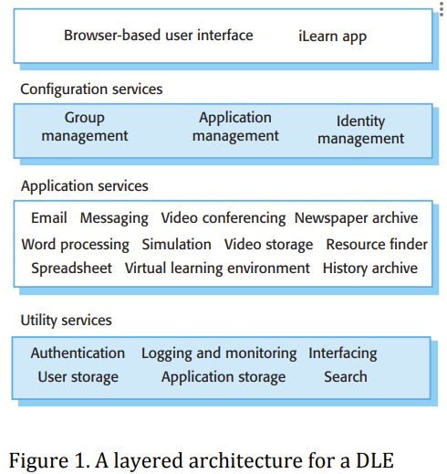

# iLearn Case Study - cited from Ian Sommerville Software Engineering, Tenth Edition 

https://software-engineering-book.com/case-studies/

This case study is part of the Open Design Case Study project. This work is licensed under the Creative Commons Attribution-NonCommercial 3.0 ([CC BY-NC 3.0](https://creativecommons.org/licenses/by-nc/3.0/us/)) United States License.

### Citation

Sommerville, I. (2016) Software Engineering. 10th Edition, Pearson Education Limited, Boston.

### Title

iLearn: A digital learning environment

### Objectives

The iLearn system is a digital learning environment (DLE) used to support learning in schools with students from age 4 to 18. It is intended to replace an existing system (Glow) that was specially built for the purpose and which includes its own applications for e-mail, etc. Glow was a closed system where it was impossible for users to introduce their own applications. It became less and less used as the facilities in freely available systems were far superior to those offered in the closed system.

### Stakeholder

- Scottish Government (client)
- Government officials/bodies
- Teachers
- Students
- Parents
- Guardians

### Requirements

#### Description

1. Utility services that provide basic application-independent functionality and which may be used by other services in the system. Utility services are usually developed or adapted specifically for this system.
2. Application services that provide specific applications such as email, conferencing, photo sharing etc. and access to specific educational content such as scientific films or historical resources. 
3. Application services are external services that are either specifically purchased for the system or are available freely over the Internet.
4. Configuration services that are used to adapt the environment with a specific set of application services and do define how services are shared between students, teachers and their parents.

#### Constraints

1. The need to accommodate a range of users from age 3 to (potentially) age 83. 
    - Parents and grandparents were potential system users. 
    - Some of the most creative users couldn’t actually read.
2. The very complex system of governance for the system involving at least 33 separate bodies.
3. A heterogeneous hardware base, widely differing hardware procurement policies and network access across schools.
4. An operational environment where policies were not necessarily driven by educational considerations but were focused on avoiding reputational and legal risks.
5. A user base that had either never taken up the existing system or who were abandoning its use.

#### Quality Attributes

- Usability - The system must be much easier to use than the existing system. 
- Flexibility - Users should be able to use the tools and services that they believed were the most appropriate for the learning involved. There should be no restrictions placed on the use of the system either by local authority Internet filtering policies or by arbitrary choices of what tools should be made available. 
- Coolness - The system must look ‘cool’ or it won’t be accepted by young people.

### Environment

#### Entities and Assumptions

| Entities  | Assumptions  |
|---|---|
|  Students | Performing learning, sharing, and social activites on the iLearn platform  |
| Teachers | Moderates, organize, and manage a wide variety of activites on the iLearn platform  |
| Parents/Guardians  | Consume contents uploaded on iLearn, communicate with teachers and other parents/guardians  |
| Lessons | Learning activities initated by teachers|
| Groups | Social community created by teachers to allow students and parents to share contents for educational purposes |
| Contents | A variety of learning materials such as newspaper archive, videos, photos, spreadsheet, etc. uploaded by teachers or students | 

### Design Solution

Proposed Architecture Model

1. Utility services- These are services that provide functionality that may be required by a number of other services. Authentication, authorisation and
storage are obvious examples here but there may well be other common services that will be included. Utility services are integrated services
2. Productivity package- This will offer services such as word processing, spreadsheets, email, etc. Currently MS Office 365
3. Application services- These are services that offer specific application functionality e.g. a virtual learning environment (VLE) to manage student work, a specific art package for primary school children, etc. Application services may be integrated or independent services and may or may not make use of the utility services in the system.Whatapplication services should be provided initially is an issue for the group looking at the user requirements for iLearn.

### Outcome

#### Success

1. **Requirement/Constraint - The need to accommodate a range of users from age 3 to (potentially) age 83.** 

The completely configurable architecture meant that versions of the system could be easily created for different types of user. 
It was quite possible for these to include different services that did the same thing so that there could  be a simple service for people new to the system and a more comprehensive service for those with experience.

2. **Requirement/Constraint - The very complex system of governance with no single decision making body.**

The flexibility of the system meant that there could be localised versions if necessary, reflecting the policies of each local authority.

3. **Requirement/Constraint - A heterogeneous hardware base, widely differing hardware procurement policies and network access across schools.**

By choosing a service-based approach, everything ran in a browser so hardware incompatibilities were minimised. 
The author also recommended that IOS and Android versions of apps to access the system should be made available.

4. **Requirement/Constraint - An operational environment where policies were not necessarily driven by educational considerations but were focused on avoiding reputational and legal risks.**

The author proposed an interfacing service so that local authorities could connect the DLE to their own systems that implemented their policies. "

5. **Requirement/Constraint - A user base that had either never taken up the existing system or who were abandoning its use.**

The author proposed that the authentication service could make use of Facebook or Google authentication systems so avoiding one of the major critiques of the existing system. 
The system flexibility meant that teachers and students could use familiar services within the system and they hoped that this would reduce their reluctance to become involved

#### Failure

**Root cause(s)**

1. A number of different software engineering methods including viewpoint oriented requirements, use-cases, and UML modeling were used but ended up failing. 
- The main reasons why these software engineering methods failed were firstly (and most importantly) users did not care about the system requirements and did not have time to interact with the development team. 
- Secondly, stakeholders simply did not understand the terminology or approaches used – terms such as use-case simply made no sense to them.
2. Disengaged users - end-users not to wish to take time out from their normal job to discuss new systems which offer them no real benefits

### Lesson Learned

1. The only approach which worked was user stories, which people without a technical background could easily relate to.
2. More and more systems are being developed for use by professionals to support their work. These professionals have the discretion to accept or reject these systems. 
- Furthermore, these professionals all have access to and experience with generic services available over the Internet and these set a standard that they expect in their professional systems. 
- While this system is specialised for educational professionals, the author believe that the lessons learned here are likely to be applicable for systems developed for lawyers, accountants, dentists and other professional users."
3. Complex governance arrangements are becoming increasingly common as new systems are integrated by creating systems of systems, where the constituent systems are owned and managed by different organisations.
- The increasing power of the media means that more and more organisations are risk averse and anxious to avoid any publicity that affects their reputation.
4. As e-government systems are developed to provide services to citizens, we have a situation where users of the system cannot be managed and there are no sanctions that can be applied for not using the system. 
- Complex security features will alienate users and stop them accessing the system. 
- If the information in these systems is not organised clearly, then people will struggle with their use.

### Teaching Materials

#### Suggested Usage

1. Discussions of the use of user stories as a means of deriving system requirements. User stories were extensively used here by the development team to get an overall picture of how the system might be used.
2. Lectures about architecture, where the layered architecture of the system can be discussed. Elements in the architecture are implemented as replaceable services.
3. General discussions of systems of systems. This was designed as a system of systems with the digital learning system interacting with other network management and administrative systems.
4. Discussions of sociotechnical systems and complexity. In this system, the technical complexity is relatively low but the governance complexity is very high.

### Other notes and resources

Complete documentation about the case study is available here:

- [Case Study Description](https://software-engineering-book.com/case-studies/ilearn/)
- [Article that discuss the socio-technical problem when designing the iLearn system](https://arxiv.org/pdf/1411.3948.pdf)
- [Proposed Architectural Solution](https://www.dropbox.com/s/6axsd1f5os5zpud/Architecture%20proposal%20.pdf?dl=0/)

